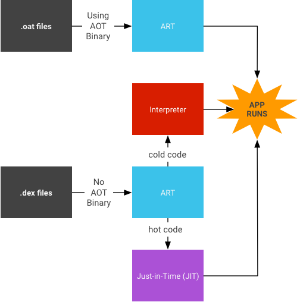

<!-- toc -->

# About Android

Android is a mobile operating system developed by Google, based on the Linux kernel and designed primarily for touchscreen mobile devices such as smartphones and tablets. Android's user interface is mainly based on direct manipulation, using touch gestures that loosely correspond to real-world actions, such as swiping, tapping and pinching, to manipulate on-screen objects, along with a virtual keyboard for text input. In addition to touchscreen devices, Google has further developed Android TV for televisions, Android Auto for cars, and Android Wear for wrist watches, each with a specialized user interface. Variants of Android are also used on game consoles, digital cameras, PCs and other electronics.

Initially developed by Android Inc., which Google bought in 2005, Android was unveiled in 2007, along with the founding of the Open Handset Alliance – a consortium of hardware, software, and telecommunication companies devoted to advancing open standards for mobile devices. Beginning with the first commercial Android device in September 2008, the operating system has gone through multiple major releases, with the current version being 8.0 "Oreo", released in August 2017. Android applications ("apps") can be downloaded from the Google Play store, which features over 2.7 million apps as of February 2017. Android has been the best-selling OS on tablets since 2013, and runs on the vast majority of smartphones. As of May 2017, Android has two billion monthly active users, and it has the largest installed base of any operating system.

Android's source code is released by Google under an open source license, although most Android devices ultimately ship with a combination of free and open source and proprietary software, including proprietary software required for accessing Google services. Android is popular with technology companies that require a ready-made, low-cost and customizable operating system for high-tech devices. Its open nature has encouraged a large community of developers and enthusiasts to use the open-source code as a foundation for community-driven projects, which deliver updates to older devices, add new features for advanced users or bring Android to devices originally shipped with other operating systems. The extensive variation of hardware in Android devices causes significant delays for software upgrades, with new versions of the operating system and security patches typically taking months before reaching consumers, or sometimes not at all. The success of Android has made it a target for patent and copyright litigation between technology companies.

## Global partnerships and large installed base

Building on the contributions of the open-source Linux community and more than 300 hardware, software, and carrier partners, Android has rapidly become the fastest-growing mobile OS. Android’s openness has made it a favorite for consumers and developers alike, driving strong growth in app consumption. Android users download more than 1.5 billion apps and games from Google Play each month. For developers, Android innovation lets you build powerful, differentiated applications that use the latest mobile technologies.

## Powerful development framework

Easily optimize a single binary for phones, tablets, and other devices. Android gives you everything you need to build best-in-class app experiences. It gives you a **single application model** that lets you deploy your apps broadly to hundreds of millions of users across a **wide range of devices** - from phones to tablets and beyond.

Android also gives you tools for creating apps that look great and take advantage of the hardware capabilities available on each device. It automatically adapts your UI to look its best on each device, while giving you as much control as you want over your UI on different device types.

For example, you can create a single app binary that's optimized for both phone and tablet form factors. You declare your UI in lightweight sets of XML resources, one set for parts of the UI that are common to all form factors and other sets for optimizations specific to phones or tablets. At runtime, Android applies the correct resource sets based on its screen size, density, locale, and so on.

To help you develop efficiently, the Android Developer Tools offer a full Java IDE with advanced features for developing, debugging, and packaging Android apps. Using the IDE, you can develop on any available Android device or create virtual devices that emulate any hardware configuration.

Open marketplace for distributing your apps
Google Play is the premier marketplace for selling and distributing Android apps. When you publish an app on Google Play, you reach the huge installed base of Android.

## Open marketplace for distributing your apps

As an open marketplace, Google Play puts you in control of how you sell your products. You can publish whenever you want, as often as you want, and to the customers you want. You can distribute broadly to all markets and devices or focus on specific segments, devices, or ranges of hardware capabilities.

You can monetize in the way that works best for your business—priced or free, with in-app products or subscriptions - for highest engagement and revenues. You also have complete control of the pricing for your apps and in-app products and can set or change prices in any supported currency at any time.

## Who actually makes Android phones?

Any handset maker is free to make an Android phone if they want to. The likes of Motorola, HTC, Samsung and Sony, Acer, Alcatel, Asus, Huawei, LG and ZTE have all made Android phones (and tablets). Blackberry has put out several Android phones since 2015, including the Priv and the KEYOne. And Nokia is enjoying a resurgence in 2017, thanks in large part to its new Nokia 3, 5 and 6 phones which run Android OS.

Although Google owns the OS (Android), the company has not made any of the smartphones on which it runs in-house (it did make the Android-powered Pixel C tablet in 2015). However, it has partnered with various handset manufacturers over the years to make its own-brand smartphones under the 'Nexus' name.

![Nexus Phones[^1]](img/nexus_phones.png)

[^1]: Source https://recombu.com/mobile/article/what-is-android-and-what-is-an-android-phone_M12615.html

Google's Nexus phones were typically the first to receive new updates and were considered to be the flagship Android phones, even though some other Android devices sported larger screens, better cameras and more powerful hardware.

In 2016, Google shelved the Nexus brand name and replaced by launching two new phones called the Pixel and Pixel XL. For all intents and purposes, these new phones enjoy all the same benefits as the Nexus devices did and are essentially the spiritual successors to the Nexus line.

## Fragmentation

One frequent criticism of Android is that it's a fragmented platform. Phone carriers like Motorola, HTC, LG, Sony, and Samsung have added their own user interfaces to Android and have no intentions to stop. They feel it distinguishes their brand, although developers often express their frustration at having to support so many variations.

## The Bottom Line

Android is an exciting platform for consumers and developers. It is the philosophical opposite of the iPhone in many ways. Where the iPhone tries to create the best user experience by restricting hardware and software standards, Android tries to ensure it by opening up as much of the operating system as possible.

This is both good and bad. Fragmented versions of Android may provide a unique user experience, but they also mean fewer users per variation. That means it's harder to support for app developers, accessory makers, and technology writers (ahem). Because each Android upgrade must be modified for the specific hardware and user interface upgrades of each device, that also means it takes longer for modified Android phones to receive updates.

Fragmentation issues aside, Android is a robust platform that boasts some of the fastest and most amazing phones and tablets on the market.

## Android versions

Google is constantly working on new versions of the Android software. These releases are infrequent; at the moment Google is releasing a big Android update once a year.

Versions usually come with a numerical code and a name that’s so far been themed after sweets and desserts, running in alphabetical order.

![Android Versions[^2]](img/android_versions.png)

[^2]: Source https://recombu.com/mobile/article/android-versions

![Android Versions Listing[^3]](img/android_versions_listing.png)

The version history of the Android mobile operating system began with the public release of the Android beta in November 5, 2007. The first commercial version, Android 1.0, was released in September 2008. Android is continually developed by Google and the Open Handset Alliance, and it has seen a number of updates to its base operating system since the initial release.

Versions 1.0 and 1.1 were not released under specific code names. Android code names are confectionery-themed and have been in alphabetical order since 2009's Android 1.5 Cupcake, with the most recent major version being Android 8.0 Oreo, released in August 2017.

[^3]: Source https://en.wikipedia.org/wiki/Android_version_history

Check out [https://developer.android.com/about/index.html](https://developer.android.com/about/index.html) for more info on each version. Also [https://en.wikipedia.org/wiki/Android_version_history](https://en.wikipedia.org/wiki/Android_version_history) provides a nice overview of the new features of each version.

## Android Platform Architecture

Android is an open source, Linux-based software stack created for a wide array of devices and form factors. The following diagram shows the major components of the Android platform.

[^4]: Source https://developer.android.com/guide/platform/index.html

### The Linux Kernel

The foundation of the Android platform is the Linux kernel. For example, the Android Runtime (ART) relies on the Linux kernel for underlying functionalities such as:
* Memory management
* Process management
* Networking
* Threading

Using a Linux kernel allows Android to take advantage of key security features and allows device manufacturers to develop hardware drivers for a well-known kernel.

### Hardware Abstraction Layer (HAL)

The hardware abstraction layer (HAL) provides **standard interfaces** that expose device hardware capabilities to the higher-level Java API framework. The HAL consists of multiple library modules, each of which implements an interface for a specific type of hardware component, such as the camera or bluetooth module. When a framework API makes a call to access device hardware, the Android system loads the library module for that hardware component.

### Android Runtime
For devices running Android version 5.0 (API level 21) or higher, each app runs in **its own process** and with **its own instance of the Android RunTime (ART)**. ART is written to run multiple virtual machines on low-memory devices by executing DEX files, a bytecode format designed specially for Android that's optimized for minimal memory footprint. Build toolchains compile Java sources into DEX bytecode, which can run on the Android platform.

At install time, ART compiles apps using the on-device *dex2oat* tool. This utility accepts DEX files as input and generates a compiled app executable for the target device. Prior to Android version 5.0 (API level 21), Dalvik was the Android runtime.

Using ART the whole code of the app will be pre-compiled during install (once), thus removing the lag that we see when we open an app on our device. As ART runs app machine code directly (native execution), it doesn't hit the CPU as hard as just-in-time code compiling on Dalvik. Less CPU usage results in less battery drain, which is a big plus for portable devices in general.

Android runtime (ART) includes a just-in-time (JIT) compiler with code profiling that continually improves the performance of Android applications as they run. The JIT compiler complements ART's current ahead-of-time (AOT) compiler and improves runtime performance, saves storage space, and speeds application and system updates. It also improves upon the AOT compiler by avoiding system slowdown during automatic application updates or recompilation of applications during over-the-air (OTA) updates.

[^5]: Source https://source.android.com/devices/tech/dalvik/jit-compiler

Android also includes a set of core runtime libraries that provide most of the functionality of the Java programming language.

### Native C/C++ Libraries
Many core Android system components and services, such as ART and HAL, are built from native code that require native libraries written in C and C++. The Android platform provides Java framework APIs to expose the functionality of some of these native libraries to apps. For example, you can access OpenGL ES through the Android framework’s Java OpenGL API to add support for drawing and manipulating 2D and 3D graphics in your app.

If you are developing an app that requires C or C++ code, you can use the Android NDK to access some of these native platform libraries directly from your native code.

### Java API Framework

The entire feature-set of the Android OS is available to you through APIs written in the Java language. These APIs form the building blocks you need to create Android apps by simplifying the reuse of core, modular system components and services, which include the following:

* A rich and extensible View System you can use to build an app’s UI, including lists, grids, text boxes, buttons, and even an embeddable web browser
* A Resource Manager, providing access to non-code resources such as localized strings, graphics, and layout files
* A Notification Manager that enables all apps to display custom alerts in the status bar
* An Activity Manager that manages the lifecycle of apps and provides a common navigation back stack
* Content Providers that enable apps to access data from other apps, such as the Contacts app, or to share their own data
* Developers have full access to the same framework APIs that Android system apps use.

### System Apps
Android comes with a set of core apps for email, SMS messaging, calendars, internet browsing, contacts, and more. Apps included with the platform have no special status among the apps the user chooses to install. So a third-party app can become the user's default web browser, SMS messenger, or even the default keyboard (some exceptions apply, such as the system's Settings app).

The system apps function both as apps for users and to provide key capabilities that developers can access from their own app. For example, if your app would like to deliver an SMS message, you don't need to build that functionality yourself - you can instead invoke whichever SMS app is already installed to deliver a message to the recipient you specify.

As developers, we are able to write applications which replace any existing system app. This means that users are not required to use the default system app. It also means that there is an equality among apps. However in reality most systems apps are not replaced by other apps by the general user. They will use what is available and install what is missing.
