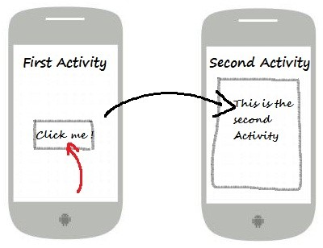
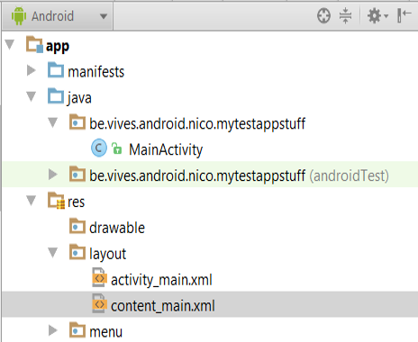

<!-- toc -->

# Activities

Activities are one of the fundamental building blocks of apps on the Android platform. An activity is the *entry point for interacting with the user*. It represents a single screen with a user interface. For example, an email app might have one activity that shows a list of new emails, another activity to compose an email, and another activity for reading emails. Although the activities work together to form a cohesive user experience in the email app, each one is independent of the others. As such, a different app can start any one of these activities if the email app allows it. For example, a camera app can start the activity in the email app that composes new mail to allow the user to share a picture.



An activity facilitates the following key interactions between the system and the app:
* Keeping track of what the user currently cares about (what is on screen) to ensure that the system keeps running the process that is hosting the activity.
* Knowing that previously used processes contain things the user may return to (stopped activities), and thus more highly prioritize keeping those processes around.
* Helping the app handle having its process killed so the user can return to activities with their previous state restored.
* Providing a way for apps to implement user flows between each other, and for the system to coordinate these flows. (The most classic example here being share.)

You implement your own activities as subclasses of the `Activity` class.

Most apps contain multiple screens, which means they comprise multiple activities. Typically, one activity in an app is specified as the main activity, which is the first screen to appear when the user launches the app. Each activity can then start another activity in order to perform different actions.

To use activities in your app, you must register information about them in the app's manifest, and you must manage activity lifecycles appropriately. The former is automatically added by Android Studio. An example of a main activity is shown below in the XML partial.

```XML
<activity
    android:name=".MainActivity"
    android:label="@string/app_name"
    android:theme="@style/AppTheme.NoActionBar">
    ...
</activity>
```

The only required attribute for this element is `android:name`, which specifies the class name of the activity. You can also add attributes that define activity characteristics such as `android:label`, `android:icon`, or `android:theme`.

The name of the class that implements the activity, a subclass of Activity, should have a name that is a fully qualified class name (such as, `be.vives.nico.hello_world.MainActivity`). However, as a shorthand, if the first character of the name is a period (for example, `.MainActivity`), it is appended to the package name specified in the `<manifest>` tag.

Notice the `@string/app_name` reference. This mechanism allows us to put ALL strings inside an XML file which can be found in `res/values/strings.xml`.
It allows us to bundle all strings used inside the application inside a single file. This has a couple of advantages:
* Easy to change and reuse text
* Faster and easier to translate application

```xml
<resources>
    <string name="app_name">HelloWorldInAndroid</string>
    <string name="action_settings">Settings</string>
    <string name="title_activity_about">AboutActivity</string>
</resources>
```

## Creating New Activities

In Android Studio all you need to do to create a new activity is navigating to `File => New => Activity => Gallery`. Choose one of the templates and give the activity a name. For the moment you can choose the "Empty Activity" or "Blank Activity". Make sure to always add the suffix `Activity` to the name of the activity. For example `AboutActivity`.

When creating a new activity most of the start code is generated by the IDE.

```java
package be.vives.nico.hello_world.helloworldinandroid;

import android.os.Bundle;
//...

public class MainActivity extends AppCompatActivity {

    @Override
    protected void onCreate(Bundle savedInstanceState) {
      super.onCreate(savedInstanceState);
      setContentView(R.layout.activity_main);
      Toolbar toolbar = (Toolbar) findViewById(R.id.toolbar);
      setSupportActionBar(toolbar);

        FloatingActionButton fab = (FloatingActionButton) findViewById(R.id.fab);
        fab.setOnClickListener(new View.OnClickListener() {
            @Override
            public void onClick(View view) {
                Snackbar.make(view, "Replace with your own action", Snackbar.LENGTH_LONG)
                        .setAction("Action", null).show();
            }
        });
    }
    //...
}
```

Almost all activities interact with the user, so the `Activity` class takes care of creating a window for you in which you can place your UI with setContentView(View). The activity loads its UI component from the XML layout files.

The Layout can be found as two files inside `res/layout`
* `content_main.xml`, which contains the actual layout we want to display to the user
* `activity_main.xml`, which acts a container for the content and some other things like a toolbar. It also defines the general layout of the activity



## Lifecycle of an Activity


As a user navigates through, out of, and back to your app, the Activity instances in your app transition through different states in their lifecycle. The Activity class provides a number of callbacks that allow the activity to know that a state has changed: that the system is creating, stopping, or resuming an activity, or destroying the process in which the activity resides.

Within the lifecycle callback methods, you can declare how your activity behaves when the user leaves and re-enters the activity. For example, if you're building a streaming video player, you might pause the video and terminate the network connection when the user switches to another app. When the user returns, you can reconnect to the network and allow the user to resume the video from the same spot. In other words, each callback allows you to perform specific work that's appropriate to a given change of state. Doing the right work at the right time and handling transitions properly makes your app more robust and performant. For example, good implementation of the lifecycle callbacks can help ensure that your app avoids:

* Crashing if the user receives a phone call or switches to another app while using your app.
* Consuming valuable system resources when the user is not actively using it.
* Losing the user's progress if they leave your app and return to it at a later time.
* Crashing or losing the user's progress when the screen rotates between landscape and portrait orientation.
