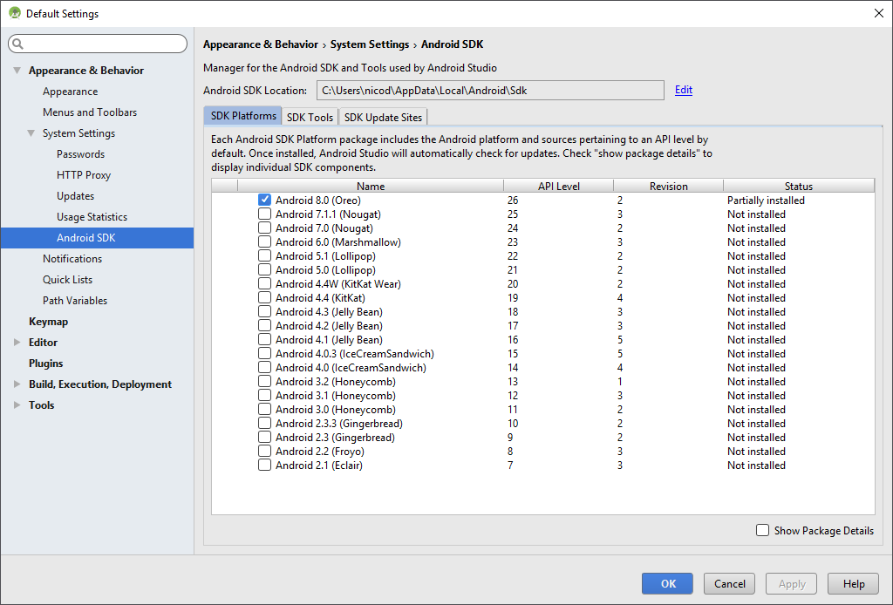
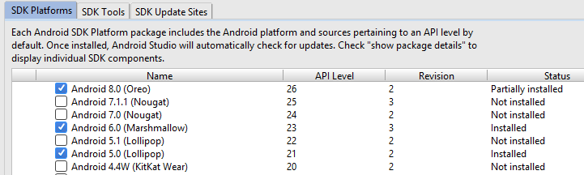
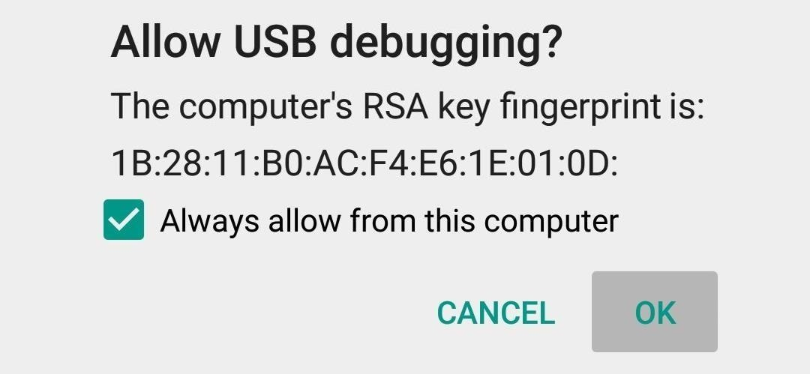
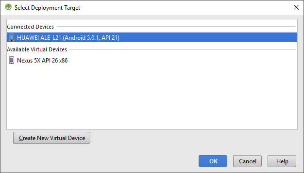
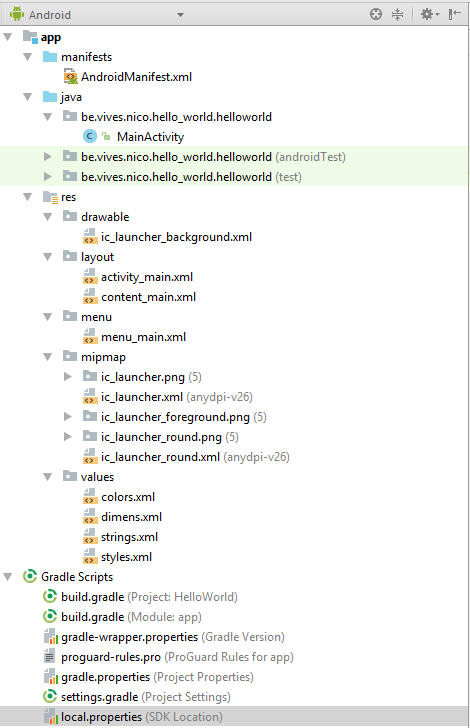
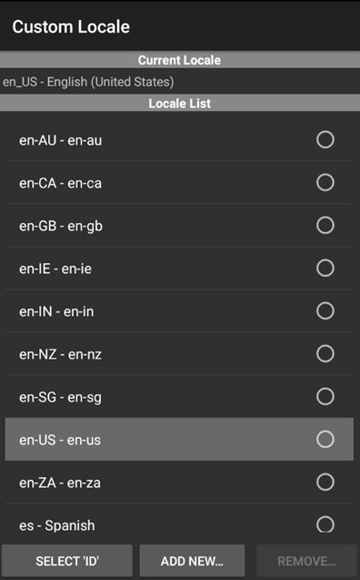

<!-- toc -->

# Hello Android World

For the development of Android applications we will make use of an IDE (Integrated Development Environment) called Android Studio. This is the official standard and is considered the best (only) option out there.

## Android Studio

Android Studio is the official IDE for Google's Android operating system, built based on JetBrains' IntelliJ IDEA software and designed specifically for Android development. It is available for download on Windows, macOS and Linux based operating systems. It is a replacement for the Eclipse Android Development Tools (ADT) as primary IDE for native Android application development.

The current stable version is 2.3.3, released in June 2017. Next major update, version 3.0, is in preview stage as of August 2017.

Since we love working on the edge, we will be using the preview version, eagerly awaiting the stable release of it. Navigate to (https://sillevl.gitbooks.io/software-installation-guide)[https://sillevl.gitbooks.io/software-installation-guide] and follow the installation guide to install the latest Android Studio 3.0 version.

### Some cool features

Android Studio has some cool and fancy features, some of which are:

* **Fast and feature-rich emulator:** Install and run your apps faster than with a physical device and test your app on virtually any Android device configuration: Android phones, Android tablets, Android Wear, and Android TV devices. The new Android Emulator 2.0 is faster than ever and allows you to dynamically resize the emulator and access a suite of sensor controls.

* **Intelligent code editor:** Write better code, work faster, and be more productive with an intelligent code editor that helps you each step of the way. Android Studio is built on IntelliJ and is capable of advanced code completion, refactoring, and code analysis.

* **Instant Run:** Push code and resource changes to your app running on a device or emulator and see the changes instantly come to life. Instant Run dramatically speeds up your edit, build, and run cycles, keeping you "in the flow."

* **Robust and flexible build system:** Easily configure your project to include code libraries and generate multiple build variants from a single project. With Gradle, Android Studio offers high-performance build automation, robust dependency management, and customizable build configurations.

* **Develop for all Android devices:** Target multiple form factors with a single project to easily share code among your different versions of your app. Android Studio provides a unified environment to develop apps for Android phones, tablets, Android Wear, Android TV, and Android Auto.

* **Code templates and GitHub integration:** Start projects with code templates for patterns such as navigation drawer and view pagers, or import Google code samples from GitHub. Android Studio's project wizards make it easier than ever to add code in a new project.

### Choosing a Target Version

Before we start with the development of Android applications we will need to decide on which version of Android we will focus. For this it's best to take a look at which version is currently deployed on most devices. As can be seen in the chart below this would be version 6.0 or Marshmallow.

![Version Usage[^1]](img/version_usage.png)

[^1]: https://developer.android.com/about/dashboards/index.html

However our phones that we currently have at our disposal are equipped with Lollipop (version 5).

Taking both into consideration we will focus on Android 5.0. However nothing is holding us back to later on evolve to Marshmallow and try it out on a virtual device.

### Installing the SDKs

Before one can start with the development of applications for Android its necessary to install the correct SDKs (Software Development Kit). The Android SDK provides you with the API libraries and developer tools necessary to build, test, and debug apps for Android.

When launching Android Studio you will get presented with the welcome screen shown below. From here projects can be created, opened, imported, ... but also other Android Studio components can be launched.


One of them is the SDK manager. To open the SDK manager select the "Configure" option at the bottom right corner and choose "SDK Manager".

The SDK manager will show the currently installed SDK versions.



Too allow us to develop for both Marshmallow and for Lollipop we will need to install both SDK versions. Check both API 21 and API 23 and hit the "Apply" button. Do make sure to accept the license agreement otherwise some components may not be installed.


Sit back for a minute as this will take some time. Do not select other versions as it will take too much time to install.



If you wish to add other versions later on, please feel free but do it outside of the course hours as it does take a long time.

## Creating your first Android application

In this section we will create a simple "Hello World" Android application to get a hang of the flow of creating an application. You will learn how to create an Android project with Android Studio and run a debuggable version of the application inside a virtual device and on an actual phone. Let's get started.

### Creating a Project

Start by opening Android Studio. If you have no active projects you will get the following screen. Choose "Start a new Android Studio project" to launch the project wizard.


If you have an active project in Android Studio you can always start a new project by navigating to "File => New Project".

The first thing you will need to do is give your application a **meaningful name**. Let's for example name it "HelloWorld". Also provide a company domain which will be used to build the package hierarchy in Java. A good example for this is `hello_world.nico.vives.be`. However you create your own. It follows the same format as a domain name.

> #### Info::Company Domain Name
> The domain name is used by Android Studio to generate a package name. Your package name is just a unique identifier for your application in the Google Play Store.
> It can be anything you want as long as it is unique. Generally, we use reverse domain names like *com.something*.


Next is to select our minimal target SDK. Just as the wizard states: "Low API levels target more devices, but offer fewer API features". This is because when features are added and you application needs to stay compatible with a lower version, most often these features will not be available for you. You need to make a decent decision here. Choosing a too low SDK version will not give you a lot of new features, but aiming to high will not allow most devices to run your application.


The next step consists of choosing a first activity (screen) for the application. More information on this later. Now you should select the "Basic Activity" to get a simple and basic screen with a single button on it. This does not force anything for the rest of your application. It just serves as a starting point.

> #### Info::Activity
> An **activity** represents a single screen with a user interface just like a window or frame.


Last we need to give this first screen a name. This is actually the name of the class in Java that the activity will get. "MainActivity" is actually not such a bad name for your main application screen.


Once done, hit the finish button to launch the project view of your new application inside Android Studio.

### Creating a Virtual Device

Before we test our application on a physical device, it's a good idea to test it on a virtual device. In practice this is often done as not each Android developer has multiple devices at his disposal. Let us for example create a table device. Inside Android Studio navigate to "Tools => Android => AVD Manager", where AVD stands for Android Virtual Device.


Start the AVD wizard by selecting "Create Virtual Device ...". First you need to select which type of device you would like to create. Since we have phones in the LAB, it would be useful to create a tablet device. Select the tablet category and choose a generic 10.1 inch tablet. Of course not all existing devices are available here as a predefined template. However using the "New Hardware Profile" option you can specify all the parameters of your virtual device. More on this later.


Next the Android version needs to be specified for the device. Since the LAB smartphones are running Android 5.0.1, we will choose Marshmallow for our virtual device. This allows us to test our application with both Android versions on both a smartphone and a tablet. You will first need to download the image. This can be accomplished by selecting the "Download" option next to the name of the Android version.


Give the AVD a decent name, as more will be created as we progress through this course. You can also set some other options such as the default startup orientation (portrait or landscape). You can also enable the device frame to show a realistic device frame around the emulator window.


Feel free to create a new AVD later on and experiment with all the settings. Not much wrong you can do, chances of creating a black hole are slim at best.

One you click finish your new device should be available in the AVD manager.


You can now close the AVD manager.

### Running the Application on a Virtual Device

When you want to run your application you have two options on how to run the app:
* **Run app**: (SHIFT-F10) this deploys the application on the device (virtual or not) and starts it. If anything goes wrong it just crashes. Not much you can do about it.
* **Debug app**: (SHIFT-F9) when running an application in debug mode, a special connection is made between your application and the IDE. This is typically called the attachment of a debugger. This allows you to monitor every step your application performs and even allows you to intervene. You can for example run parts of code line by line, or place a breakpoint where the application should pause until the debugger states it can continue (most often by your action as a programmer).

While developing applications we will most often start the app in debug mode. Even if we do not monitor it using the debugger. This because you will get a lot more information when the application crashes. This information is found in the debugger logs. But more on this later.

When you select to run your application (either in debug mode or normal mode) a window will appear asking on which device you wish to run the app. Since we do not have a physical device attached yet, we will only see the virtual tablet device.

<!-- TODO: What with devices with a lower API than minimum? Do they show up or are they hidden at that point ? -->


Select the device and hit OK. The virtual device should boot and your application should be started. Congrats you just ran your first virtual android application.


Want to try something interactive? Hit the envelope at the bottom right corner.

See the action menu on the right of the AVD window? Try rotating the device.

> #### Info::Do not close the AVD
> You should not close the AVD window while developing. Otherwise the device is shut down and it needs to restart the next time you choose to run your application. Just minimize it to save time. If you change something in your application and you run it, it will be redeployed on the AVD.

## Setting up a Physical Device

For the LABs you can use your own Android device (if it supports at least Android 5.0) or you can use one of our devices. Most of our devices are Huawei P8 Lite smartphones. Decent phones for a decent price.


When you receive them for the first time please reset them to factory settings by opening "Settings => Backup & reset => Factory data reset" and selecting "Reset phone". Also make sure to check "Erase internal storage". Confirm to continue resetting the device.

Configure the device after it has restarted. You can logon to the "campusroam" WiFi network.

You can use your own google account or choose to create a new one. Once identified you can choose not to login using the account. This way no one has access to your account. This will mean you will not be able to access the store or check your mails. This is however not necessary for the course. You can mark the box of the phone so you can use the same phone every week in the LABs. At the end of the course you are encouraged to reset all phones back to factory settings.

### Enabling Developer mode

Next you need to unlock developer mode. This will allow you to deploy applications to the phone via USB and will also allow you to debug them.

For the Huawei P8 Lite you need to traverse to "Settings => About phone" and tap the "Build number" about 7 times. The system should display a message stating that you are now a developer.

For other types of phones this procedure might be different. Use google to find out.

### Running application on physical device

To run an application on the device you need to connect it via USB to your computer. While the device will show up in Windows Explorer as an external media device, this is not enough to deploy applications on the phone and run a debugger. You need to install additional drivers for this.

For the Huawei P8 Lite you need to install HiSuite which contains the ADB driver (Android Debug Bridge). It can be found at [http://consumer.huawei.com/minisite/HiSuite_en/](http://consumer.huawei.com/minisite/HiSuite_en/).

Once installed, start HiSuite and make sure your phone is connected via USB. You should then see a connect button in HiSuite. Click it and follow the instruction on the screen to get the device connected.

Next you will also need to enable USB debugging. Go to "Settings => Developer options" and enable "USB debugging". You will get a window asking you to confirm the attached laptop as an authorized device together with an RSA fingerprint. Select "Always allow from this computer" to make the device remember for next time.



For other phones you will need to search the Internet.

Next time you want to run your application the physical device should be in the list of target devices along side the virtual devices.



Once you hit OK, your application should appear on your phone.

## Android Project View

First, be sure the Project window is open (`View => Tool Windows => Project`) and the Android view is selected from the drop-down list at the top of that window. The Android project view in Android Studio shows a flattened version of your project's structure that provides quick access to the key source files of Android projects. Do note that the project structure on disk differs from this representation.



Let's take a look at the most important directories and files that can be found here.

* `app > java`: Contains the java source code files

  * `app > java > be.vives.nico.hello_world.helloworld > MainActivity.java`: This is the main activity (the entry point for your app). When you build and run the app, the system launches an instance of this Activity and loads its layout.


* `app > res`: Contains all the **resource files** used in the application such as images (multiple resolutions), GUI layout and string literals

 * `app > res > values > strings.xml`: Contains string literals which can be referenced inside your application. This allows for easy translation (automatically selected based on the user's locale).

 > #### Info::Locale
> In computing, a *locale* is a set of parameters that defines the user's language, country and any special variant preferences that the user wants to see in their user interface. To see which locale are supported open a AVT and launch the application "Custom Locale"



 * `app > res > layout > activity_main.xml` and `app > res > layout > content_main.xml`: These XML files define the layout for your activity's UI. As of API 23 the user interface layout is split up in two files instead of one. The `activity_main.xml` is the "outer" part of the activity layout (toolbar, action button, etc.) and `content_main.xml` is the inner part where you put your own layout (the blank space). So most of our work needs to be done inside `content_main.xml`.

While in some cases it may be quicker to edit the XML file manually, in most cases we will be using the graphical drag and drop editor. A huge advantage of Android Studio is the fact that you can immediately see the resulting GUI as you add components to it.


* `app > manifests > AndroidManifest.xml`

Every application must have an AndroidManifest.xml file (with precisely that name) in its root directory. The manifest file provides essential information about your app to the Android system, which the system must have before it can run any of the app's code.

```xml
<?xml version="1.0" encoding="utf-8"?>
<manifest xmlns:android="http://schemas.android.com/apk/res/android"
    package="be.vives.nico.hello_world.helloworld">

    <application
        android:allowBackup="true"
        android:icon="@mipmap/ic_launcher"
        android:label="@string/app_name"
        android:roundIcon="@mipmap/ic_launcher_round"
        android:supportsRtl="true"
        android:theme="@style/AppTheme">
        <activity
            android:name=".MainActivity"
            android:label="@string/app_name"
            android:theme="@style/AppTheme.NoActionBar">
            <intent-filter>
                <action android:name="android.intent.action.MAIN" />

                <category android:name="android.intent.category.LAUNCHER" />
            </intent-filter>
        </activity>
    </application>

</manifest>
```

Among other things, the manifest file does the following:

1. It **names the Java package** for the application. The package name serves as a unique identifier for the application.
2. It describes the **components of the application**, which include the activities, services, broadcast receivers, and content providers that compose the application. It also names the classes that implement each of the components and publishes their capabilities, such as the Intent messages that they can handle. These declarations inform the Android system of the components and the conditions in which they can be launched.
3. It determines the processes that host the application components.
4. It declares the **permissions** that the application must have in order to access protected parts of the API and interact with other applications. It also declares the permissions that others are required to have in order to interact with the application's components.
5. It lists the **Instrumentation classes** that provide profiling and other information as the application runs. These declarations are present in the manifest only while the application is being developed and are removed before the application is published.
6. It declares the **minimum level of the Android API** that the application requires.
7. It **lists the libraries** that the application must be linked against.

More info about the Manifest file can be found @ [https://developer.android.com/guide/topics/manifest/manifest-intro.html](https://developer.android.com/guide/topics/manifest/manifest-intro.html).

* `Gradle Scripts > build.gradle`: Gradle is an open source build automation system. You'll see two files with this name: one for the project and one for the "app" module. Each module has its own build.gradle file, but this project currently has just one module. You'll mostly work with the module's build.gradle file to configure how the Gradle tools compile and build your app. More on this later as we explore the build process of an Android Application
