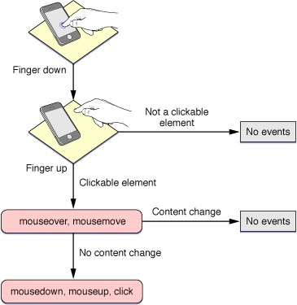
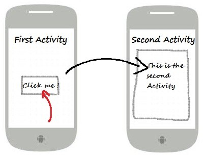
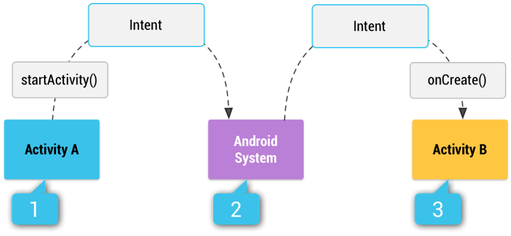

<!-- toc -->

This chapter is far from finished. Still in early draft.

# Intents

## Event Handler

An event handler is method that is called when a particular event takes place. Most typical example is the method that is called when a certain button is pressed.



An example of a button click event handler could be a Toast (small message).

```java
public void onAboutClick(View view) {
  Toast.makeText(this, "Should launch the about Activity", 	Toast.LENGTH_SHORT).show();
}
```

This code will show a small message at the bottom (called a Toast in Android) when the button is clicked.

This is also called an **event handler**:
* Note the argument which is the `View` (graphical element) that caused the event handler to be fired
* Always `public` and `void` (no return value)

While we did create a method with code to be executed when the button is pressed there is no connection between the method and the actual button. This needs to be done in the markup code of the button (in the XML file) or via the attribute editor. We call this registering an event handler

```XML
<Button
  android:layout_width="wrap_content"
  android:layout_height="wrap_content"
  android:text="About"
  android:id="@+id/btnAbout"
  android:layout_alignParentBottom="true"
  android:layout_centerHorizontal="true"
  android:onClick="onAboutClick"/>
```

Notice that we need to specify the name of the method for the `onClick` property (case sensitive). Tab completion will be your best friend if you allow it to be.

## Intents

An intent is an abstract description of an operation to be performed. It's a messaging object you can use to request an action from another app component.

An Intent provides a facility for performing late runtime binding between the code in different applications. Its most significant use is in the launching of activities, where it can be thought of as the glue between activities. It is basically a passive data structure holding an abstract description of an action to be performed.

There are three fundamental use-cases
* **To start an activity**:
 * You can start a new instance of an Activity by passing an Intent to `startActivity()`.
 * The Intent describes the activity to start and carries the necessary data.



* **To start a service**:
 * A Service is a component that performs operations in the background without a user interface.
 * You can for example start a service to perform a one-time operation (such as downloading a file) by passing an Intent to `startService()`.
 * The Intent describes the service to start and carries the necessary data.

* **To deliver a broadcast**:
 * A broadcast is a message that any app can receive.
 * The system delivers various broadcasts for system events, such as when the system boots up or the device starts charging.
 * You can deliver a broadcast to other apps by passing an Intent to `sendBroadcast()`, `sendOrderedBroadcast()`, or `sendStickyBroadcast()`.

### Types of Intents

There are two types of intents, namely explicit intents and implicit intents.

**Explicit intents** specify the component to start by name (the fully-qualified class name). You'll typically use an explicit intent to **start a component in your own app**, because you know the class name of the activity or service you want to start. When you create an explicit intent to start an activity or service, the system immediately starts the app component specified in the Intent object.

**Implicit intents** do not name a specific component, but instead **declare a general action to perform**, which allows a component from another app to handle it. For example, if you want to show the user a location on a map, you can use an implicit intent to request that a capable app shows the specified location on a map.

When you create an implicit intent, the Android system finds the appropriate component to start by comparing the contents of the intent to the intent filters declared in the manifest file of other apps on the device. If the intent matches an intent filter, the system starts that component and delivers it the Intent object. If multiple intent filters are compatible, the system displays a dialog so the user can pick which app to use.



For example
* Activity A creates an Intent with an action description and passes it to `startActivity()`.
* The Android System searches all apps for an intent filter that matches the intent.
* When a match is found, the system starts the matching activity (Activity B) by invoking its `onCreate()` method and passing it the Intent, allowing the `onCreate()` method to extract data from the Intent.

### Linking Internal Activities using Intents

An android device can have any number of activities. When your application has more than one, you most likely want to navigate from one activity to another. This can be achieved using intents.
Suppose a simple application with a `MainActivity` and an `AboutActivity`.

If you do not specify any intent filters for your activity then it cannot be invoked using implicit intents. In this case you will need to use explicit intents to start the activity inside your own application. As the about activity should only be launched from inside our application we do not need to create an intent filter.

To start the activity we use the `startActivity(Intent intent)` method as shown below.

```java
  // Launch activity by creating an explicit intent
  Intent aboutIntent = new Intent(this, AboutActivity.class);
  startActivity(aboutIntent);
```

### Creating Implicit Intents

When using implicit intents, given such an arbitrary intent we need to know what to do with it. This is handled by the process of Intent resolution, which maps an Intent to an Activity, BroadcastReceiver, or Service (or sometimes two or more activities/receivers) that can handle it.

The intent resolution mechanism basically revolves around matching an Intent against all of the `<intent-filter>` descriptions in the installed application packages.

It is also common to pass data to an activity. This can be done by using the Intent object to pass the data to the target activity. Data can be added and retrieved from an intent using the `setData()` and `getData()` methods

Let's for example say we want to open a website from our application. By creating an intent with an action of type `ACTION_VIEW` we can request the system to find us browser and open the URL we pass as data with the intent.

```java
// Create the Intent object
String url = "https://99bugs.be/";
Intent intent = new Intent(Intent.ACTION_VIEW);
intent.setData(Uri.parse(url));

// Verify that the intent will resolve to an activity
if (intent.resolveActivity(getPackageManager()) != null) {
  startActivity(intent);
}
```

Or let's say we want to search the Internet for a search term. This can be achieved by sending an implicit intent with the action set to `ACTION_WEB_SEARCH`.

```java
String queryString = "android developer";
Intent searchInternetIntent = new Intent(Intent.ACTION_WEB_SEARCH );
searchInternetIntent.putExtra(SearchManager.QUERY, queryString);
startActivity(searchInternetIntent);
```

## Responding to Implicit Intents

Earlier, you saw how an activity can invoke another activity using the Intent object.

To advertise which implicit intents your app can receive, declare one or more intent filters for each of your app components with an <intent-filter> element in your manifest file. Each intent filter specifies the type of intents it accepts based on the intent's `action`, `data`, and `category`. The system delivers an implicit intent to your app component only if the intent can pass through one of your intent filters.

The appropriate component is determined based on the intent information supplied in the *AndroidManifest.xml* file as follows:

* `<action>`, declares the intent action accepted, in the `name` attribute. The value must be the literal string value of an action, not the class constant.
* `<data>`, declares the type of data accepted, using one or more attributes that specify various aspects of the data URI (scheme (such as http: or mailto:), host, port, path) and MIME type.
* `<category>`, declares the intent category accepted, in the name attribute. The value must be the literal string value of an action, not the class constant.

Let's try it out and create a new application and add the following intent filter to the `MainActivity` in the manifest file.

```XML
<activity
  android:name=".MainActivity"
  android:label="@string/app_name"
  android:theme="@style/AppTheme.NoActionBar" >
  <intent-filter>
    <action android:name="android.intent.action.MAIN" />
    <category android:name="android.intent.category.LAUNCHER" />
  </intent-filter>
  <intent-filter>
    <action android:name="android.intent.action.VIEW" />
    <category android:name="android.intent.category.DEFAULT" />
    <data android:scheme="http" />
  </intent-filter>
</activity>
```

The data node states that the intent data should adhere to the http-scheme. In other words, the data attached to the intent object should start with `http://`.

To allow this to work we need to give the application permission to access the Internet. Place the following permission node on the same level as the application node in the manifest file.

```XML
<uses-permission android:name="android.permission.INTERNET"/>
```

Next add a WebView component to your main activity.

In the `onCreate()` method of `MainActivity` we need to get the data (the URL of the site) from the intent.


```java
@Override
protected void onCreate(Bundle savedInstanceState) {
  super.onCreate(savedInstanceState);
  setContentView(R.layout.activity_main);

  // ...

  if (getIntent().getData() != null){
    // Get the URL
    Uri url = getIntent().getData();

    // Get the WebView
    WebView webview = (WebView)findViewById(R.id.webView);

    // Specify a WebViewClient
    webview.setWebViewClient(new WebViewCallback());

    // Load up the URL
    webview.loadUrl(url.toString());
  } else {
    // Message to user we failed
  }
}
```

Now how do we test this? Quickest solution is to open the notepad application and enter a URL. When you click it you should get the option to launch your application.

If you do not declare any intent filters for an activity, then it can only be started with an explicit intent from inside your own application.

You can create a filter that includes more than one instance of <action>, <data>, or <category>. If you do, you need to be certain that the component can handle any and all combinations of those filter elements.

When you want to handle multiple kinds of intents, but only in specific combinations of action, data, and category type, then you need to create multiple intent filters.

An implicit intent is tested against a filter by comparing the intent to each of the three elements. To be delivered to the component, the intent must pass all three tests. If it fails to match even one of them, the Android system won't deliver the intent to the component. However, because a component may have multiple intent filters, an intent that does not pass through one of a component's filters might make it through on another filter.
