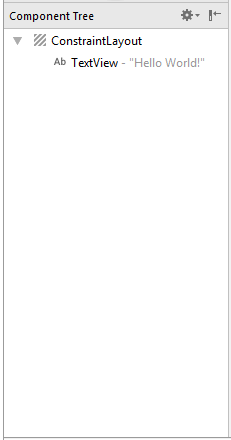
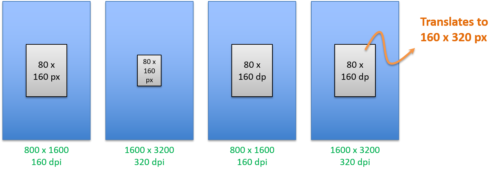

<!-- toc -->

# Interacting with the User

Interacting with a user on an Android device typically happens through the Graphical User Interface (GUI) of your app. While apps exist that have no user interface (such as services), they are not the main focus of this course.

A whole course could be spend on the different GUI components available to build the most awesome apps. This is however not the intention of this course. Most of the graphical aspects will be left to the reader to find out how they can be styled and changed to your needs. This course will focus on the programmatic aspects of building an Android app.

This chapter will give an introduction into graphical components and how to interact with them from your Java code.

## Activities

The `Activity` class serves as the entry point for an app's interaction with the user, providing the window in which the app draws its UI. This window typically fills the screen, but may be smaller than the screen and float on top of other windows. You implement an activity as a subclass of the Activity class. Generally, one activity implements one screen in an app. For instance, one of an app's activities may implement the Preferences screen, while another activity implements the Compose Email screen.

Most apps contain multiple screens, which means they comprise multiple activities. Typically, one activity in an app is specified as the main activity, which is the first screen to appear when the user launches the app. Each activity can then start another activity in order to perform different actions.


For example, the main activity in a simple e-mail app may provide the screen that shows an e-mail inbox. From there, the main activity might launch other activities that provide screens for tasks like writing e-mails and opening individual e-mails.

Although activities work together to form a cohesive user experience in an app, each activity is only loosely bound to the other activities; there are usually minimal dependencies among the activities in an app. In fact, activities often start up activities belonging to other apps. For example, a browser app might launch the Share activity of a social-media app.

To use activities in your app, you must register information about them in the app's manifest, and you must manage activity lifecycles appropriately. Skillfully managing activities allows you to ensure that, for example:
* Orientation changes take place smoothly without disrupting the user experience.
* User data is not lost during activity transitions.
* The system kills processes when it's appropriate to do so.

This course will return on these topics later.

The Java code behind your main activity can be found under `app > java > be.vives.<yourname>.hello_world > MainActivity.java`. Some boilerplate code has already been prepared for you.

```java
// ...
public class MainActivity extends AppCompatActivity {

    @Override
    protected void onCreate(Bundle savedInstanceState) {
        super.onCreate(savedInstanceState);
        setContentView(R.layout.activity_main);
        // ...
    }
    // ...
}
```

The two most important lines of code for now are the ones shown. They are responsible for loading the your layout at the moment that the activity is started.

More on this later.

## Views and ViewGroups

The user interface for an Android activity is built using a hierarchy of layouts (`ViewGroup` objects) and widgets (`View` objects). Layouts are invisible containers that control how its child views are positioned on the screen. Widgets are UI components such as buttons and text boxes.

![Hierarchy of Views and ViewGroups[^1]](img/viewgroup_2x.png)
[^1]: Source: https://developer.android.com/training/basics/firstapp/building-ui.html

Android provides an XML vocabulary for `ViewGroup` and `View` classes, so most of your UI is defined in XML files. However, instead of teaching you to write some XML, we'll be using the drag-and-drop layout editor of Android Studio to build a simple GUI.

As stated before the actual layout file for the main activity can be found at `app > res > layout > content_main.xml`. Notice at the bottom left corner of the editor you can switch between *Design* and *Text*. This allows you to switch between drag-and-drop and XML editing.

The Component Tree window on the bottom-left side shows the layout's hierarchy of views. In this case, the root view is a `ConstraintLayout`, containing just one `TextView` object.



`ConstraintLayout` is a layout container that defines the position for each view based on constraints to sibling views (views on the same hierarchy level - brother and sister components as it were) and the parent layout. In this way, you can create both simple and complex layouts with a flat view hierarchy. That is, it avoids the need for nested layouts (a layout inside a layout), which can increase the time required to draw the UI.

![Two views positioned inside ConstraintLayout[^2]](img/constraint-example_2x.png)
[^2]: Source: https://developer.android.com/training/basics/firstapp/building-ui.html

## Building a Basic Input Form

Try building a basic input form using `TextView`, `EditText` and `Button` components like shown below. Experiment a bit with the different options of the drag-and-drop editor. For some tips on using the anchors you can take a look at [https://developer.android.com/training/basics/firstapp/building-ui.html#textbox](https://developer.android.com/training/basics/firstapp/building-ui.html#textbox).


Try to build it component per component. Not all at once. The first time you will need to start the application via `Run => Run 'app'` but after changing a little bit you can just apply the changes using `Run => Apply Changes`. This is much faster.

While not critical for the workings of your application, it is good practice and a good idea to give all your Views a decent name. This is achieved by setting the `ID` attribute.


The component tree could look a bit like the one shown below.


The attributes pane shows the basic properties of a View. However most views have a lot more attributes that can be changed. These can be accessed by clicking `View all attributes` at the bottom left corner of the attributes pane or by click the small two-arrow icon at the top right corner.


Many views have padding and margin you can play around with to change the appearance of the controls. For example for the button `padding_horizontal` was set to `32dp` and `padding_vertical` was set to `16dp`.

### Absolute and Relative Sizing

In general, specifying a layout width and height using absolute units such as pixels is not recommended. Instead, using relative measurements such as density-independent pixel units (dp), `wrap_content`, or `match_parent`, is a better approach, because it helps ensure that your application will display properly across a variety of device screen sizes.

SP and DP define two different units used in android for defining layout properties like margins, text size, etc. SP stands for scale-independent pixels, and DP is density-independent pixels. SP and DP are quiet the same, except that SP has an additional scaling factor based on the user’s preferred text size. SP must be used for defining text sizes but not for layout sizes.

SP and DP fall into the category of android relative units. These units are used in creation of user interfaces in XML and programmatically implemented in code.  DP stands for density independent pixels whereas SP stands for Scale independent pixels.

DP is an abstract or virtual unit which is based on the physical density of the screen. One DP means one pixel on a 160 dpi screen. Increase in the screen resolution will also increase the number of pixels represented in 1 unit of DP. Similarly, for lower resolution, this number of pixels represented in one unit of dp will decrease. It is a relative unit and therefore baseline of 160 dpi (dots per inch) screen has been selected.

SP is similar to the DP unit but additionally it is also scaled according to the font size preference of the user. SP is important as it provides a link between the users chosen text and the text in the application. A user can increase or decrease the size of text according to his own requirement. These SP or scaled pixels take care of this issue.

Some absolute units include mm (millimeter), in (inches), pt (points) and px (pixels). These should all be avoided as they will not scale between different devices and screen sizes.


